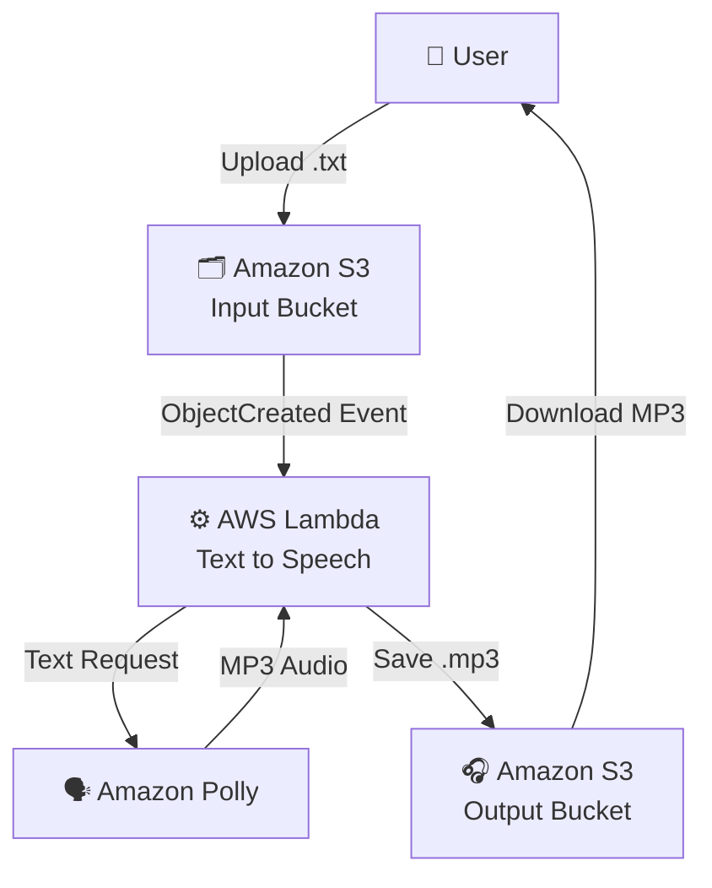

# 🎧 Study Vault - Text to Speech AWS Project


## 📋 Descripción

Study Vault es una aplicación serverless en AWS que convierte notas de texto en audio usando Amazon Polly, permitiendo estudiar en movimiento mediante una arquitectura escalable y de bajo costo.

### Problema que resuelve
Las notas escritas no siempre son accesibles cuando estás en movimiento. Este proyecto permite estudiar mientras caminas, viajas o haces ejercicio.

## 🏗️ Arquitectura




**Servicios AWS utilizados:**
- **S3**: Almacenamiento de archivos de entrada y salida
- **Lambda**: Procesamiento serverless
- **Amazon Polly**: Conversión de texto a voz
- **CloudWatch**: Logs y monitoreo
- **IAM**: Gestión de permisos

## 💰 Costos estimados

- S3: ~$0.50/mes
- Lambda: Gratis (1M invocaciones/mes)
- Amazon Polly: $4 por 1M caracteres
- **Total: $1-3/mes** con uso moderado

## 🚀 Cómo desplegar

### Requisitos previos
- AWS CLI configurado
- Terraform instalado
- Python 3.9+

### Pasos de despliegue
```bash
# 1. Clonar el repositorio
git clone https://github.com/TU-USUARIO/study-vault-aws.git
cd study-vault-aws

# 2. Inicializar Terraform
cd terraform
terraform init

# 3. Desplegar infraestructura
terraform apply

# 4. Obtener los nombres de los buckets
terraform output
```

##  Cómo usar

1. Sube un archivo `.txt` al bucket de entrada
2. Espera 30-60 segundos
3. Descarga el archivo `.mp3` del bucket de salida

## 🛠️ Tecnologías

- **Infrastructure as Code**: Terraform
- **Lenguaje**: Python 3.9
- **Cloud Provider**: AWS
- **CI/CD**: GitHub Actions (próximamente)

## 📚 Aprendizajes

Este proyecto demuestra:
- ✅ Arquitectura event-driven
- ✅ Servicios serverless
- ✅ Integración de servicios AWS
- ✅ Automatización con IA (Polly)
- ✅ Infraestructura como código

## 🔮 Mejoras futuras

- [ ] Frontend web para subir archivos
- [ ] Notificaciones por email cuando el audio esté listo
- [ ] Soporte para múltiples idiomas
- [ ] API REST para integración con otras apps

##  Autor

**Andrés Rodas**  
Informatics Engineering Student – UPCH  

☁️ Cloud Enthusiast  

- 💼 **LinkedIn:** www.linkedin.com/in/andres-rodas-802309272 
- 📧 **Email:** andrescloud18sj@gmail.com

## 📄 Licencia

MIT License
